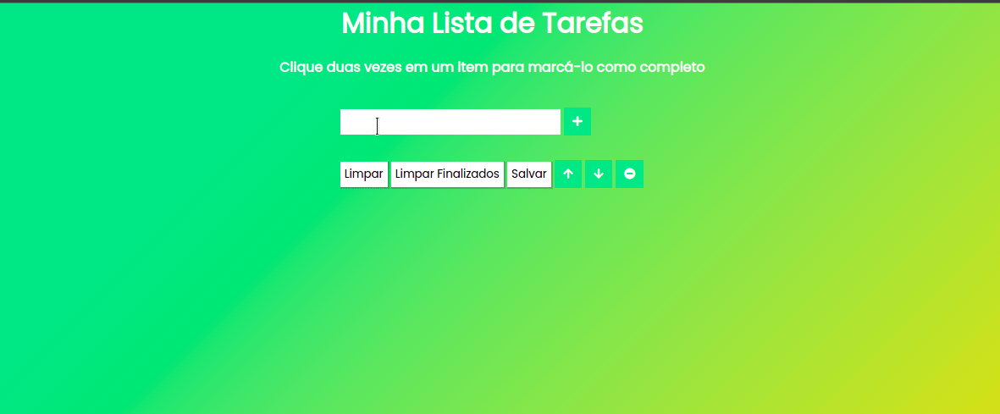

<h1 align="center">
    
</h1>

## **SOBRE**
Projeto criado dentro do módulo de Fundamentos na **Trybe**.

O objetivo neste projeto era a criação de uma To-Do List com opção de salvar as tarefas no **LocalStorage** para que o usuário tenha acesso mesmo se fechar o navegador.

### **Habilidades**
- Manipular CSS

- Manipular Javascript

### **TÉCNOLOGIAS UTILIZADAS**
- HTML
- CSS
- JavaScript

